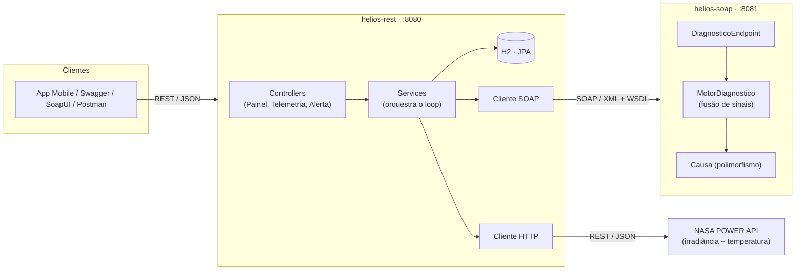
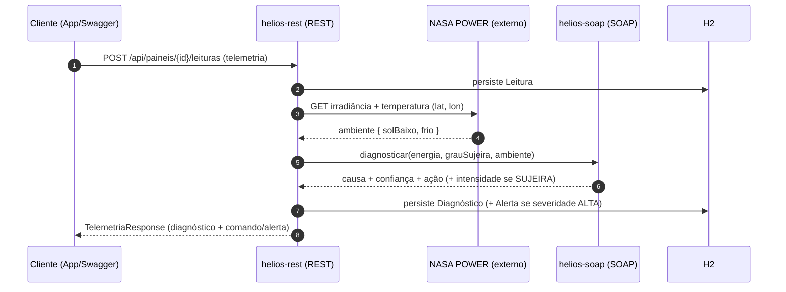

# HÉLIOS — Documentação da Solução (SOA)

> **Global Solution 2026.1 · FIAP · Tema: Space Connect — Tecnologia Espacial Aplicada a Desafios Reais**
> Disciplina: **SOA (Service-Oriented Architecture)**
>
> _Este documento reúne todo o conteúdo exigido para o PDF de entrega. Exporte para PDF
> (VS Code “Markdown PDF”, Typora, ou Pandoc). Diagramas em Mermaid renderizam no GitHub
> e na maioria dos exportadores._

## Integrantes

| Nome completo | RM |
|---|---|
| Arthur Abonizio | 555506 |
| Gabriel Padula | 554907 |
| Rodrigo Nakata | 556417 |

---

## 1. Descrição da solução

O **HÉLIOS** é um sistema autônomo que mantém a geração de energia de uma **base lunar**
detectando quando um painel solar gera menos do que deveria, **diagnosticando a causa**
(cruzando energia + grau de sujeira + ambiente) e, se for **sujeira**, acionando uma
**limpeza por vibração** (sem água, sem contato). O ciclo é **perceber → diagnosticar → agir → verificar**.

Este módulo entrega a **camada de serviços distribuídos (SOA)** que costura esse ciclo:
uma **API REST** (dados, CRUD, orquestração) e um **Web Service SOAP** (motor de diagnóstico),
que se integram entre si e com uma **API externa da NASA** para obter as condições de ambiente.

## 2. Problema

Na Lua, a **poeira eletrostática** cobre os painéis e derruba a geração. Não há pessoal para
limpar e a distância Terra–Lua (~1,3 s-luz) inviabiliza o controle remoto — **a decisão precisa
acontecer no local**. Além disso, uma queda de energia é **ambígua**: pode ser sujeira, sombra,
trinca, frio, sol baixo ou defeito elétrico. Agir errado (ex.: vibrar um painel **trincado**)
piora o problema. É preciso **diagnosticar antes de agir**.

## 3. Objetivos

- Expor, como **serviços distribuídos**, o ciclo de detecção → diagnóstico → ação.
- **Diagnosticar a causa** da perda de energia por fusão de sinais, e só limpar quando for sujeira.
- Demonstrar os princípios de **SOA** (baixo acoplamento, contratos, interoperabilidade, reutilização).
- Persistir o histórico (painéis, leituras, diagnósticos, alertas) e oferecer uma **API documentada**.

## 4. Arquitetura da solução

Projeto Maven **multi-módulo** com dois serviços que conversam, mais uma API externa.



_Fallback ASCII (caso o exportador de PDF não renderize Mermaid):_

```
        [ NASA POWER API ]  (irradiância + temperatura, por satélite)
                 ^  REST/JSON
                 |
  App/Swagger --REST/JSON-->  helios-rest (:8080)  --SOAP/XML+WSDL-->  helios-soap (:8081)
                              - CRUD PainelSolar                       - DiagnosticoEndpoint
                              - persistência H2                        - MotorDiagnostico
                              - orquestra o loop                       - Causa (polimorfismo)
                              - cliente SOAP + HTTP
```

**Separação de responsabilidades:**

| Componente | Responsabilidade |
|---|---|
| `helios-rest` (8080) | CRUD de `PainelSolar`, persistência H2, orquestração do loop, cliente SOAP e cliente da API externa |
| `helios-soap` (8081) | Motor de diagnóstico (regras), exposto como Web Service SOAP contract-first com WSDL |
| NASA POWER | Serviço externo de ambiente (irradiância solar + temperatura por satélite) |

### 4.1 Diagrama SOA (princípios)

- **Baixo acoplamento / separação de responsabilidades:** REST (dados) ≠ SOAP (regras) ≠ externo (ambiente).
- **Contratos de serviço:** **WSDL** (SOAP, contract-first a partir de um XSD) + **OpenAPI/Swagger** (REST).
- **Interoperabilidade:** dois protocolos distintos — **REST/JSON** e **SOAP/XML** — conversando.
- **Reutilização:** o serviço de Diagnóstico é consumido pelo loop e pode ser reusado pelo app/outros clientes via o mesmo contrato.

### 4.2 Fluxo do loop (a integração)



## 5. Explicação da API REST

- **Base:** `http://localhost:8080`
- **Documentação interativa (Swagger):** `/swagger-ui.html` · **OpenAPI JSON:** `/v3/api-docs`
- **Console do banco:** `/h2-console` (JDBC `jdbc:h2:mem:helios`, user `sa`, sem senha)
- **Entidade principal do CRUD:** `PainelSolar`

### 5.1 Endpoints

| Método | Caminho | Descrição | Sucesso |
|---|---|---|---|
| `GET` | `/api/paineis` | Lista painéis | `200` |
| `GET` | `/api/paineis/{id}` | Detalha um painel | `200` / `404` |
| `POST` | `/api/paineis` | Cadastra painel | `201` + `Location` |
| `PUT` | `/api/paineis/{id}` | Atualiza painel | `200` / `404` |
| `DELETE` | `/api/paineis/{id}` | Remove painel (bloqueia se houver histórico) | `204` / `409` |
| `POST` | `/api/paineis/{id}/leituras` | Envia telemetria e executa o loop | `200` |
| `GET` | `/api/paineis/{id}/diagnosticos` | Histórico de diagnósticos do painel | `200` |
| `GET` | `/api/alertas?apenasAbertos=true` | Lista alertas | `200` |
| `PUT` | `/api/alertas/{id}/reconhecer` | Resolve um alerta | `200` / `404` |

### 5.2 Exemplos

**Criar painel** — `POST /api/paineis`

```json
{ "codigo": "PAINEL-A", "nome": "Painel A - Base Sul",
  "potenciaNominalW": 210.0, "latitude": -23.5, "longitude": -46.6 }
```

Resposta `201 Created`:

```json
{ "id": 1, "codigo": "PAINEL-A", "nome": "Painel A - Base Sul",
  "tipo": "PAINEL_SOLAR", "potenciaNominalW": 210.0,
  "latitude": -23.5, "longitude": -46.6, "ativo": true }
```

**Enviar telemetria (loop)** — `POST /api/paineis/1/leituras`

```json
{ "valorEnergia": 142.0, "grauSujeira": 0.47, "quedaGradual": true, "pontoQuente": false }
```

Resposta `200 OK` (real, capturada em teste):

```json
{ "painelId": 1, "ativoId": "PAINEL-A", "leituraId": 1,
  "ambiente": { "solBaixo": false, "frio": false, "fonte": "nasa-power" },
  "diagnostico": { "causa": "SUJEIRA", "confianca": 0.788, "severidade": "ALTA",
    "acaoRecomendada": "VIBRAR", "intensidadeVibracao": 0.47,
    "evidencias": ["queda_0.32","cobertura_0.47","queda_gradual","ambiente_normal"],
    "timestamp": "2026-06-01T14:03:01" },
  "comando": { "atuadorId": "VIB-PAINEL-A", "acao": "VIBRAR", "intensidade": 0.47, "duracaoSeg": 6 },
  "alerta": { "id": 1, "severidade": "ALTA", "tipo": "SUJEIRA_DETECTADA",
    "mensagem": "Perda de 32% — causa SUJEIRA. Ação recomendada: VIBRAR.", "resolvido": false } }
```

### 5.3 Validação e tratamento de erros

Validação com **Bean Validation** e tratamento centralizado (`@RestControllerAdvice`) com corpo JSON padronizado:

| Situação | Status |
|---|---|
| Campo inválido (ex.: `potenciaNominalW <= 0`, `grauSujeira` fora de 0..1) | `400` |
| Corpo ausente / JSON malformado / tipo de parâmetro inválido | `400` |
| `Content-Type` não suportado | `415` |
| Método HTTP não suportado | `405` |
| Recurso inexistente | `404` |
| Código duplicado / painel com histórico no DELETE / violação de integridade | `409` |
| Serviço SOAP indisponível | `503` |

Exemplo de erro (`400`):

```json
{ "timestamp": "2026-06-04T20:24:34", "status": 400, "erro": "Bad Request",
  "mensagem": "Falha de validação nos campos enviados.",
  "caminho": "/api/paineis", "campos": { "codigo": "codigo é obrigatório" } }
```

## 6. Explicação do Web Service SOAP

- **Estilo:** **contract-first** — o contrato é o XSD (`helios-soap/src/main/resources/xsd/diagnostico.xsd`); o WSDL é gerado a partir dele (Spring-WS).
- **WSDL:** `http://localhost:8081/ws/diagnostico.wsdl`
- **Endpoint:** `http://localhost:8081/ws`
- **Namespace:** `http://helios.fiap.com.br/soap/diagnostico`

### 6.1 Operações

| Operação | Tipo | Descrição |
|---|---|---|
| `diagnosticar` | **processamento** | Recebe os sinais (energia, grau de sujeira, ambiente) e devolve a **causa** classificada, com confiança, severidade, ação recomendada e (se sujeira) intensidade de vibração. |
| `consultarHistorico` | **consulta** | Devolve os diagnósticos já realizados para um `ativoId`. |

### 6.2 Estruturas XML — requisição/resposta

**`diagnosticar` — requisição:**

```xml
<soapenv:Envelope xmlns:soapenv="http://schemas.xmlsoap.org/soap/envelope/"
                  xmlns:dia="http://helios.fiap.com.br/soap/diagnostico">
  <soapenv:Body>
    <dia:diagnosticarRequest>
      <dia:ativoId>PAINEL-A</dia:ativoId>
      <dia:valorEnergia>142.0</dia:valorEnergia>
      <dia:esperadoEnergia>210.0</dia:esperadoEnergia>
      <dia:grauSujeira>0.47</dia:grauSujeira>
      <dia:quedaGradual>true</dia:quedaGradual>
      <dia:pontoQuente>false</dia:pontoQuente>
      <dia:solBaixo>false</dia:solBaixo>
      <dia:frio>false</dia:frio>
    </dia:diagnosticarRequest>
  </soapenv:Body>
</soapenv:Envelope>
```

**`diagnosticar` — resposta (real):**

```xml
<SOAP-ENV:Envelope xmlns:SOAP-ENV="http://schemas.xmlsoap.org/soap/envelope/">
  <SOAP-ENV:Body>
    <ns2:diagnosticarResponse xmlns:ns2="http://helios.fiap.com.br/soap/diagnostico">
      <ns2:diagnostico>
        <ns2:ativoId>PAINEL-A</ns2:ativoId>
        <ns2:causa>SUJEIRA</ns2:causa>
        <ns2:confianca>0.788</ns2:confianca>
        <ns2:severidade>ALTA</ns2:severidade>
        <ns2:acaoRecomendada>VIBRAR</ns2:acaoRecomendada>
        <ns2:intensidadeVibracao>0.47</ns2:intensidadeVibracao>
        <ns2:evidencia>queda_0.32</ns2:evidencia>
        <ns2:evidencia>cobertura_0.47</ns2:evidencia>
        <ns2:evidencia>queda_gradual</ns2:evidencia>
        <ns2:evidencia>ambiente_normal</ns2:evidencia>
        <ns2:timestamp>2026-06-01T14:03:01</ns2:timestamp>
      </ns2:diagnostico>
    </ns2:diagnosticarResponse>
  </SOAP-ENV:Body>
</SOAP-ENV:Envelope>
```

**`consultarHistorico` — requisição:**

```xml
<dia:consultarHistoricoRequest>
  <dia:ativoId>PAINEL-A</dia:ativoId>
</dia:consultarHistoricoRequest>
```

### 6.3 Falhas (SOAP Fault)

Entradas inválidas (ex.: `esperadoEnergia <= 0`, `grauSujeira` fora de 0..1, `ativoId` vazio)
disparam um **SOAP Fault** (`faultcode` Client) via `DiagnosticoInvalidoException`.

### 6.4 Matriz de diagnóstico (regras do motor)

| Sintoma (energia) | Visão | Ambiente | Causa | Ação |
|---|---|---|---|---|
| Queda + ponto quente | trinca/dano | — | **DANO_FISICO** | alerta, **não vibra** |
| Queda gradual | cobertura de poeira | sol/temp normais | **SUJEIRA** | **vibrar** (modulado) |
| Queda | painel limpo | sol baixo / frio | **AMBIENTAL** | sem ação |
| Queda | painel limpo | normais | **FALHA_ELETRICA** | alertar humano |
| Queda súbita | — | — | **SOMBRA** | aguardar |
| Sem queda | — | — | **SEM_FALHA** | nenhuma |

> **Decisão de projeto:** `DANO_FISICO` é avaliado **antes** de `AMBIENTAL` — um painel trincado
> nunca é mascarado por “sol baixo/frio”. `FALHA_ELETRICA` fica por último (diagnóstico de exclusão).

## 7. Integração entre serviços

A solução demonstra **as duas formas** exigidas:

1. **REST ↔ SOAP:** ao receber telemetria, o `helios-rest` invoca a operação `diagnosticar`
   do `helios-soap` (cliente `WebServiceTemplate` + JAXB) para classificar a causa.
2. **Consumo de serviço externo:** o `helios-rest` consome a **NASA POWER** (REST/JSON) para
   obter irradiância e temperatura e derivar o ambiente (`solBaixo`, `frio`).

**Resiliência:** se o SOAP estiver fora, a API responde `503`; se a NASA falhar, usa **ambiente
simulado** (fallback) e o loop continua. Falhas de validação do SOAP viram `400` (não `503`).

## 8. Persistência

Banco **H2** (in-memory) via **Spring Data JPA**. Entidades: `PainelSolar` (raiz, herda de
`Ativo`), `Leitura`, `Diagnostico`, `Alerta`. CRUD completo na entidade principal e histórico
persistido das demais.

## 9. POO — os 4 pilares

| Pilar | Onde |
|---|---|
| **Abstração** | `Causa` (SOAP) e `Ativo` (REST) são classes abstratas que definem o contrato comum. |
| **Encapsulamento** | Campos privados com acesso por métodos; validação nas bordas (DTOs/motor). |
| **Herança** | `Causa → Sujeira, Sombra, DanoFisico, FalhaEletrica, Ambiental, SemFalha`; `Ativo → PainelSolar`. |
| **Polimorfismo** | `MotorDiagnostico` devolve uma `Causa` cujo `severidade()`, `acaoRecomendada()` e `intensidadeVibracao()` variam por subclasse. |

## 10. Tecnologias utilizadas

Java 21 · Spring Boot 3.3.5 · Spring Web (REST) · **Spring Web Services** (SOAP contract-first) ·
Spring Data JPA · **H2** · springdoc-openapi (**Swagger/OpenAPI**) · **Maven** (multi-módulo) ·
**NASA POWER API** (serviço externo) · SoapUI (testes SOAP).

## 11. ODS e conexão com o tema

**Space Connect:** o HÉLIOS aplica **tecnologia espacial** (dados de satélite da NASA + automação
para colonização lunar) a um **desafio real** (manter energia limpa funcionando sem intervenção humana).

- **ODS 7 — Energia limpa e acessível:** mantém a geração solar eficiente.
- **ODS 9 — Indústria, inovação e infraestrutura:** automação e diagnóstico inteligente.
- **ODS 11 — Cidades e comunidades sustentáveis:** uso dual na Terra (limpeza sem água de usinas em regiões áridas).
- **ODS 13 — Ação contra a mudança climática:** mais energia limpa, sem desperdício de água.

## 12. Evidências de funcionamento

Os roteiros prontos (REST, SOAP e o loop completo) estão em **[`docs/EVIDENCIAS.md`](docs/EVIDENCIAS.md)**,
com os comandos exatos e os resultados esperados para você **executar e printar**.
Inclui também **[`docs/requests.http`](docs/requests.http)** (REST) e **[`docs/soap-requests.md`](docs/soap-requests.md)** (envelopes SOAP).

> Espaços para os prints: Swagger UI · CRUD no Postman/REST Client · WSDL no navegador ·
> `diagnosticar`/`consultarHistorico` no SoapUI · loop end-to-end (SUJEIRA e DANO) · console H2.

## 13. Como executar

Pré-requisito: **JDK 21** (Maven via wrapper `./mvnw`).

```bash
./mvnw clean install                 # Windows: .\mvnw.cmd clean install
./mvnw -pl helios-soap spring-boot:run   # SOAP em :8081
./mvnw -pl helios-rest spring-boot:run   # REST em :8080
```

## 14. Conclusão

O HÉLIOS-SOA demonstra, de ponta a ponta, uma **arquitetura orientada a serviços**: uma API REST
e um Web Service SOAP com contratos próprios (OpenAPI e WSDL), integrados entre si e a um serviço
externo da NASA, com baixo acoplamento e responsabilidades bem separadas. O sistema não apenas
reage a quedas de energia — ele **diagnostica a causa** e age de forma proporcional, provando os
princípios de SOA aplicados a um problema real da indústria espacial.
